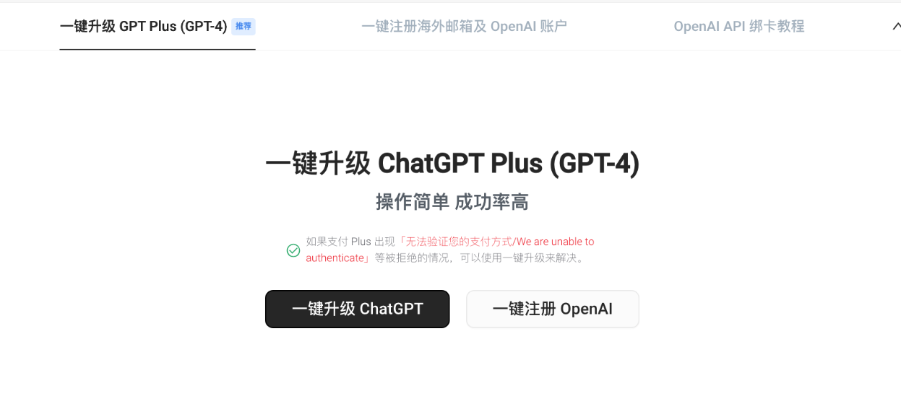
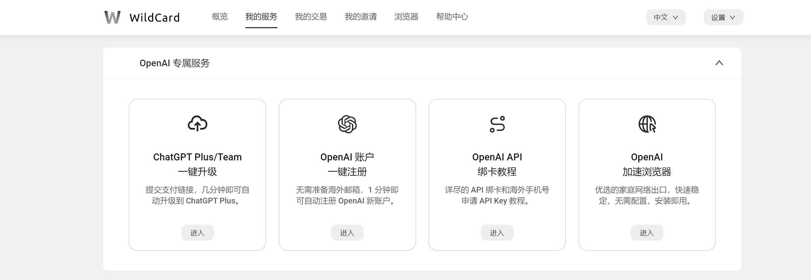

# **ChatGPT一键注册+升级(2024年2月亲测)**

## 如何升级 ChatGPT 4.0

### 	一个网站搞定原生Open AI：

[https://bewildcard.com/i/AI686]: （https://bewildcard.com/i/AI686	"）"

##### 		（ps：如果这都懒得做可以找我帮你直接开通：微信：tyf_cscsu)

​	这是一个虚拟卡平台（正规的，支付宝可以充值），开卡之后可以用 1年或者2 年，并且提供了一键注册GPT3.5账号和一键升级GPT4.0的能力（注册的时候如果没有填邀请码，可以手动填入邀请码AI686，可以免 2 美元的开卡费）

​	开通的是有效期1-2年的虚拟信用卡，开卡费包含两年年费，大约 70 元RMB，每天成本不到 1.5 毛钱，根据个人需求充值来决定1年或者2年。如果没有消费成功，可以提现余额到支付宝。

​	下面是有关ChatGPT的介绍了（只关心注册的不用看嘞）

### ChatGPT 是什么

​	简而言之，ChatGPT 是一个由 OpenAI 开发的人工智能语言模型，基于 GPT（Generative Pre-trained Transformer）架构。它被训练用于自然语言理解和生成任务，可以用于各种文本生成和对话系统应用。ChatGPT 能够理解自然语言输入并生成符合上下文的响应，它在聊天机器人、智能助手、智能客服等领域具有广泛的应用。

## ChatGPT 官网

​	**ChatGPT**的官网是 [https://chat.openai.com](https://chat.openai.com/)

​	国内山寨版本很多，不是这个域名的ChatGPT服务都是镜像站或者假冒伪劣网站，请注意辨别。（虽然也能用，就是正确性不会很高）

### ChatGPT4.0 的优势

1. **更强大的语言理解能力：** ChatGPT 4.0 可能会进一步改善对输入文本的理解能力，使其能够更准确地把握上下文并生成更相关的响应。

2. **更流畅的对话体验：** 新的版本可能会改进对话的流畅性和连贯性，使得生成的对话更加自然。

3. **更准确的信息获取和总结：** 可能会加强 ChatGPT 在提供信息、回答问题和总结文本内容方面的能力。

4. **更好的适应性和可定制性：** OpenAI 可能会为用户提供更多定制化和适应性的选项，使得用户可以更好地根据自己的需求定制 ChatGPT 的行为。

5. **更加智能的上下文理解：** ChatGPT 4.0 可能会更好地理解长期对话中的上下文，从而生成更具连贯性和逻辑性的回复。

6. **更快的响应速度和更高的效率：** OpenAI 可能会优化模型以提高其处理速度和效率，使得用户可以更快地获得响应。

7. **更多的安全和隐私保护功能：** 鉴于对话系统中的隐私和安全问题越来越受关注，ChatGPT 4.0 可能会增加更多的安全和隐私保护功能，以确保用户信息的安全。

​	这也是目前为止，我唯一一个愿意每个月掏 20 美元付费的产品。

### 升级 4.0 为什么这么难？

​	但是升级 ChatGPT 4.0 很麻烦，不仅需要国外 VISA、Master 等双币信用卡，还需要有干净的 IP （国外IP，梯子用的人少），CHATGPT 是使用 stripe 进行收款，stripe 会根据账单地址、IP 地址等进行风控，国内付款一般都会被拦截。

​		常常会见到这些报错：	

- Your credit card was declined.Try paying with a debit card instead.
- 您的信用卡被拒绝了。请尝试用借记卡支付。
- 你的卡已被拒绝。
- 您的金融卡已被拒绝。
- 您拒绝了。请尝试用签账卡支付。
- 我们未能验证您的支付方式。请选择另一支付方式并重试。

除此之外，升级到 ChatGPT 4.0 可能会面临一些挑战和困难，其中包括：

1. **模型复杂性：** 随着每个新版本的发布，模型的复杂性通常会增加。这意味着更多的参数、更复杂的架构和更多的训练数据，这些都需要大量的计算资源和时间来训练和调优。

2. **数据收集和标注：** 为了训练新版本的 ChatGPT，需要大量的文本数据，并且这些数据通常需要进行标注或清洗，以确保模型的质量和性能。数据收集和标注是一个耗时且繁琐的过程。

3. **模型评估和调优：** 在发布新版本之前，必须对模型进行广泛的评估和调优，以确保其性能和质量。这包括在不同的语境和任务上对模型进行测试，并对其进行修正和改进。

4. **计算资源需求：** 训练和调优大型语言模型需要大量的计算资源，包括高性能的 GPU 或 TPU，以及大量的存储空间。这些资源在很大程度上影响着升级到新版本的成本和可行性。

5. **模型稳定性和可靠性：** 在发布新版本之前，必须确保模型的稳定性和可靠性，以避免在实际应用中出现意外情况或错误。

6. **安全和隐私考虑：** 随着对话系统的广泛应用，安全和隐私成为越来越重要的问题。升级到新版本的模型可能涉及到更多的安全和隐私保护措施，这可能增加了开发的复杂性和成本。

综上所述，升级到 ChatGPT 4.0 需要克服各种技术和资源上的挑战，十分耗时。
