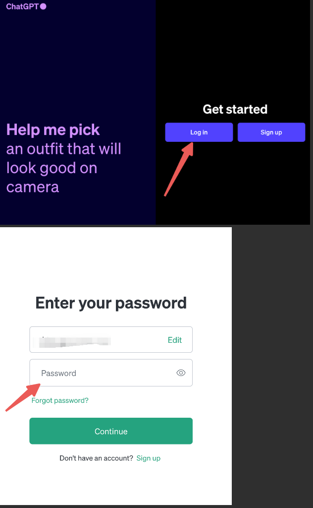

# **ChatGPT一键注册+升级(2024年3月亲测)**

## 如何升级 ChatGPT 4.0

### 		一个网站搞定原生Open AI： [https://bewildcard.com/i/AI686](https://bewildcard.com/i/AI686)

​	该平台最基本的功能主要是应用于国内一键申请GPT或者GPT Plus的综合性，简单来讲就是可以在这个平台拿到一个原生的Chat GPT3.5的独享账号，接着使用平台的功能从而使用GPT4.

##### 			（ps：如果这都懒得做可以找我帮你直接开通：微信：tyf_cscsu)

​	这是一个虚拟卡平台（正规的，支付宝可以充值），开卡之后可以用 1年或者2 年，并且提供了一键注册GPT3.5账号和一键升级GPT4.0的能力（注册的时候如果没有填邀请码，可以手动填入邀请码AI686，可以免 2 美元的开卡费）

​	开通的是有效期1-2年的虚拟信用卡，开卡费包含两年年费，大约 70 元RMB，每天成本不到 1.5 毛钱，根据个人需求充值来决定1年或者2年。如果没有消费成功，可以提现余额到支付宝。

​	下面是有关ChatGPT的详细开通步骤

### 开通ChatGPT3.5：

​	如果只是想使用3.5的功能，而不用于升级4.0，可以加我微信直接购买【30元】（微信：tyf_cscsu），也可以开卡以后直接一键注册OpenAi的账号【开卡9.9美元+0.99一键注册】。

​	如果在开通GPT3.5的基础上还要使用4.0 ，则在“我的服务”页面中点击“OpenAI账户一键注册”的进入按钮，根据提示首先在自己开的卡上面充值一定的金额，建议充值金额在25美元以上，用于购买和升级GPT的账号，接着将一键注册的账号按照下面的步骤逐步操作就可以了。【开卡9.9美元+0.99一键注册+20美元每月同官网】（提供代充服务，收取20元的手工费）

### 登录ChatGPT官网：

​	Open AI官网：  [ chat.openai.com]( chat.openai.com)

​	依次点击Log in，再输入刚才一键注册的账户邮箱和密码：

### 点击升级 Upgrade

​	登录自己的 OpenAI 帐户后，点击左下角的 Upgrade to Plus，在弹窗中选择 Upgrade plan。

​	如果升级入口无法点击，那就访问这个网址， [https://chat.openai.com/invite/accepted](https://chat.openai.com/invite/accepted)

从而进入支付页面。

### 复制支付页面网址

​	在支付页面，复制现在的付款页网址 URL，这一段 **pay.openai.com** 开头的全部网址，进入我们「一键升级 ChatGPT Plus」页面，提交就可以了。请**不要在支付页面填写任何信息**，**如果填写过，请返回上一步，**重新进入这个页面再复制网址。

### 使用 WildCard 一键升级 ChatGPT Plus

​	回到wildcard界面， 点击一键升级

​	

​	在输入框，粘贴刚刚复制的支付页面的网址，然后点击确定支付并升级。

​	 然后按步骤选择要支付的卡片，一路走下去就可以了。

！【帮助中心】的回答十分的详细，可以看看能否解决你的问题
